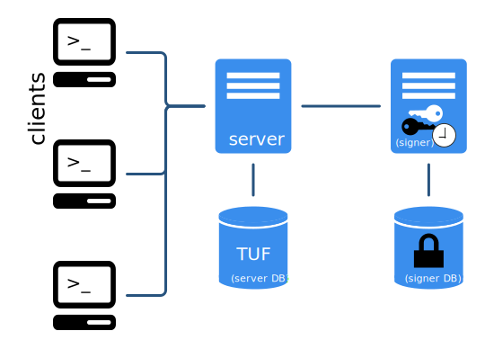
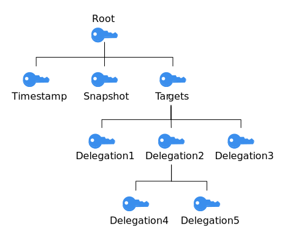
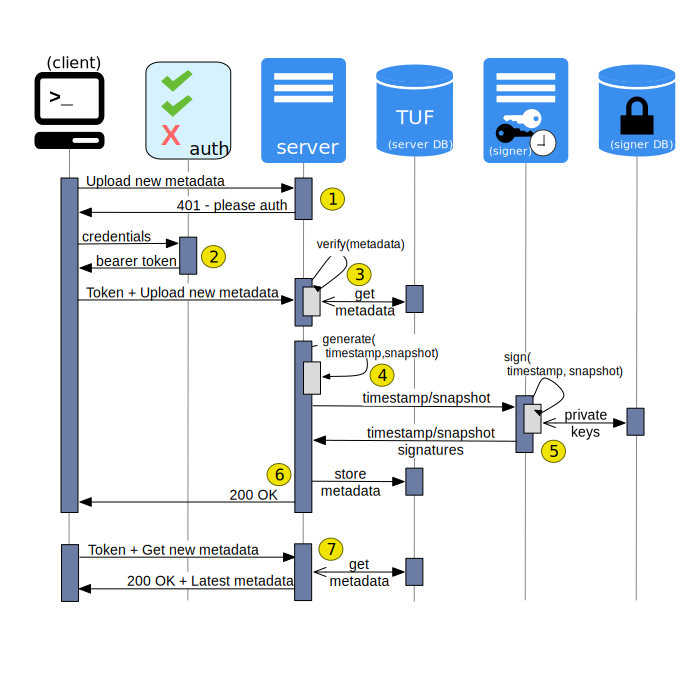

# Notary

Il seguente repository presenta una POC di funzionamento di Notary []() e ne descrive il suo funzionamento; allo scopo di realizzare una piattaforma che verifica l'autenticità e l'integrità delle immagini Docker .

## Piattaforma

La piattaforma Notary prevede l'interazione delle seguenti entità:

- `Client`: Sono entità dagli obiettivi eterogenei. Possono occuparsi di:  
  - pubblicare le immagini presso il Docker Registry, firmandole mediante la piattaforma Notary.
  - prelevare le immagini firmate presso il Docker Registry, certificandone l'autenticità e l'integrità mediante Notary.

- `Notary Server`: Servitore avente a disposizione un proprio sistema informativo (TUF Database), dedicato ad ospitare dei metadati **firmati**. Questi metadati descrivono le immagini pubblicate sul Docker Registry e vengono utilizzati nelle seguenti macrofasi:
  - `push`: Soltanto una entità fidata può pubblicare nuove `tag` sul Docker Registry e presso il Notary Server. 
  - `pull`: Verifica dell'autenticità e dell'integrità dell'immagine prelevata dal Docker Registry. 

- `Notary Signer`: Entità di Notary che ha due responsabilità:
  - Detenere le chiavi `snapshot` e `timestamp` (vedere sezione "**Chiavi utilizzate in Notary**") che firmano i metadati presenti su `Notary Server`. 
  - Firmare i metadati presenti su `Notary Server`.



## Metadati e Chiavi utilizzati in Notary

Notary si avvale di un insieme di metadati per garantire l'autenticità e l'integrità delle immagini Docker. Per garantire l'integrità e l'autenticità dei metadati censiti presso Notary, sia Client che Notary firmano i metadati pubblicati utilizzando delle chiavi distribuite gerarchicamente. 

I metadati sono

  - `root`: Incarna il punto di origine di tutta la fiducia. Contiene gli Id delle delle chiavi pubbliche dedicate alla firma dei file di metadati `root`, `targets`, `snapshot`, `timestamp`. I Client utilizzano queste chiavi pubbliche per verificare le firme di tutti i file dei metadati presenti nel repository Notary. Questo metadato viene firmato dalla chiave `root key` e questa viene detenuta da Client. La creazione di `root key` avviene generalmente all'inizializzazione di un nuovo repository di tag presso Notary: Notary opera in modalità Trust On First Use, pertanto considera a priori come `trusted` l'inizializzazione di un nuovo repository di tag.

  - `snapshot`: Verifica l'integrità degli altri file dei metadati. Viene firmato dalla chiave `snapshot key` e questa viene detenuta da Notary Signer.
  
  - `timestamp`: Si occupa di mantenere la freschezza del repository certificando quale è la versione della tag più recente. Viene firmato dalla chiave `timestamp key` e questa viene detenuta da Notary Signer.
  
  - `targets`: Si occupa di verificare l'integrità e l'autenticità della tag di un repository firmandone tutti i metadati (hash, dimensione, versione, ...). Viene firmato dalla chiave `targets key` e questa viene detenuta dal Client. La chiave `targets key` può anche essere utilizzata per creare chiavi di tipo `delegation key` che permettono di delegare la pubblicazione di nuove tag su un repository ad altri publisher.

Le chiavi client-side (`root key` e `targets key`, `delegation key`) sono generalmente memorizzate nel path in `~/.docker/trust/private`. Tali chiavi devono essere oggetto di processi di backup & ripristino affinchè  Client possa continuare a pubblicare nuove immagini anche a fronte di anomalie.

Le chiavi client-side sono cifrate e necessitano pertanto di una passphrase per essere decrittate.  

Relazione gerarchica delle chiavi di firma:



## Sequence Diagram

Notary adotta un approccio TOFU (Trust On First Use) per la gestione della fiducia: 

- Chiunque inizializza un nuovo repository viene a **priori considerato come `trusted`** da parte di Notary. Questo implica che 

- Pubblicazioni di metadati su un repository già esistente vengono invece verificate sulle delle chiavi pubbliche presenti sul TUF database di Notary Server e create in fase di inizializzazione di quel repository. L'owner di quel repository può delegare push di nuovi 


In questa sezione descriviamo il sequence diagram tra i principali attori coinvolti nella pubblicazione dei metadati firmati.

Nota: Il Docker Registry è completamente **agnostico** rispetto alla presente interazione.



- Notary Server può supportare modalità di autenticazione basate su JWT. Questo richiede l'introduzione di un Authorization Server.

- Il Client si autentica presso Authorization Server e ottiene un token di accesso che userà per le successive iterazioni con Notary Server.

- Il Client carica i metadati descriventi una tag di un repository presso il Notary Server. Notary Server verifica la validità delle informazioni fornite Notary adottando un approccio TOFU (Trust On First Use) per la gestione della fiducia:

  - Chiunque inizializza un nuovo repository viene a **priori considerato come `trusted`**.
  - Qualora i metadati forniti descrivessero una nuova tag di un repository già censito presso Notary Server, questi vengono verificati sulla base delle chiavi pubbliche di firma dei metadati memorizzate presso Notary Server. L'interazione può proseguire soltanto in caso di verifica con successo.

- Una volta che tutti i metadati forniti dal client sono stati validati, Notary Server genera i file dei metadati `timestamp` e `snapshot` per quella determinata tag e li invia al Notary Signer per firmarli. 

- Notary Signer reperisce chiave private dal suo database, e le utilizza per firmare i metadati `timestamp` e `snapshot` ricevuti. In caso di successo, restituisce i metadati firmati a Notary Server.

- Notary Server ora ha tutti i metadati necessari per validare le future pull della tag censita. 

## POC

Il seguente repository contiene una POC sull'uso di Notary: sono presenti due progetti `docker-compose` che permettono la creazione di una infrastruttura su cui effettuare delle prove.

Prerequisiti per l'uso della POC:

- `docker`
- `docker-compose`

I due progetti `docker-compose` sono contenuti rispettivamente nelle cartelle `notary` e `notary_postgres`. Il primo progetto descrive una installazione minimale della piattaforma Notary avente tutta la parte di persistenza in memory, il secondo invece utilizza `postgres` come sistema informativo al fine di poter visionare quali sono i dati che vengono memorizzati e utilizzati da `Notary Server` e `Notary Signer`. 

La POC si ispira agli esempi presenti sul [Repository Notary ufficile](https://github.com/theupdateframework/notary), rendendo maggiormente evidenti gli aspetti di configurazione coinvolti.

# Descrizione dei container utilizzati

Ogni entry descrive il service presente nei file `docker-compose.yml` utilizzati:

- `registry`: Docker Registry utilizzato per ospitare le immagini Docker.
- `notaryserver`: Notary Server, differentemente dagli esempi del repository ufficiale, in questo caso **non** crea l'immagine mediante Dockerfile ma utilizza l'immagine Docker ufficiale già pubblicata su [DockerHub](https://hub.docker.com/_/notary).
- `notarysigner`: Notary Signer, differentemente dagli esempi del repository ufficiale, in questo caso **non** crea l'immagine mediante Dockerfile ma utilizza l'immagine Docker ufficiale già pubblicata su [DockerHub](https://hub.docker.com/_/notary).
- `postgresql`: Utilizzato solo nel progetto `notary_postgres/docker-compose.yml`. Istanzia il sistema informativo postgres utilizzato da Notary Server e Notary Signer.
- `pgadmin4`: Interfaccia visuale per esplorare `postgresql`
- `clientpublisher_trusted`: Container "docker" in "docker" che rappresenta un client **fidato**. Lo scopo di questo client consiste nell'effettuare tutti gli step a default di firma e pubblicazione di immagini Docker. Si aggancia alla socket del demone Docker in esecuzione sulla macchina host.
- `clientpublisher_malicious`: Container "docker" in "docker" che rappresenta un client **malevolo**. Lo scopo di questo client consiste nell'effettuare attacchi su Notary o Registry. Si aggancia alla socket del demone Docker in esecuzione sulla macchina host.
- `clientpublisher_untrusted`: Container "docker" in "docker" che rappresenta un client **che non utilizza Docker Content Trust**. Lo scopo di questo publisher consiste nel verificare il comportamento di Notary a fronte di presenza sul Docker Registry di immagini non firmate. Si aggancia alla socket del demone Docker in esecuzione sulla macchina host.
- `notaryserver_migrations`: Container utilizzato per effettuare le migrations su Postgres al fine di inizializzare il database per `notaryserver`, conclusa la migration, il container termina la propria esecuzione. Le migration ufficiali utilizzate sono presenti in questo [repository](https://github.com/theupdateframework/notary/tree/master/migrations).
- `notarysigner_migrations`: Container utilizzato per effettuare le migrations su Postgres al fine di inizializzare il database per `notarysigner`, conclusa la migration, il container termina la propria esecuzione. Le migration ufficiali utilizzate sono presenti in questo [repository](https://github.com/theupdateframework/notary/tree/master/migrations).


## Uso della POC

### Setup

- Prelevare le seguenti immagini Docker dalla macchina host. Saranno utilizzate per le seguenti prove:
  ```
  docker pull alpine:3.7.3
  docker pull alpine:3.8.4
  ```

- Collocarsi sul path `notary` o `notary_postgresql`, eseguire ./`launcher.sh` ed attendere che tutti i container siano up and running. 

### 1: Workflow base per la pubblicazione firmata di un container

- Connettersi presso il container `clientpublisher_trusted` mediante `docker exec -it ${container_id} sh` ed eseguire i seguenti comandi: 

  ```
  docker tag alpine:3.7.3 registry:5000/alpine:3.7.3
  docker trust key generate continuous_integration 
  docker trust signer add --key continuous_integration.pub continuous_integration registry:5000/alpine 
  docker trust sign registry:5000/alpine:3.7.3
  docker push registry:5000/alpine:3.7.3
  docker pull registry:5000/alpine:3.7.3
  ```

  I comandi effettuano le seguenti operazioni:

  - Tag dell'immagine `alpine:3.7.3` in `registry:5000/alpine:3.7.3`, al fine di poterla pubblicare presso il registry istanziato
  - Creazione di una `delegation key`, che andrà a firmare il `registry:5000/alpine`.
  - Censimento della responsabilità `delegation key` di dover firmare il repository `registry:5000/alpine` (`GUN`). Poichè non sono mai stati creati altri GUN con valore `registry:5000/alpine` presso Notary Server, questa operazione va a buon fine per via del modello di funzionamento di Notary (Trust On First Use - TOFU).
  - Firma della `registry:5000/alpine:3.7.3` (dalle variabili di ambiente Docker comprende la destinazione Notary per la consegna dei metadati firmati). Poichè non sono mai stati creati altri GUN con valore `registry:5000/alpine` presso Notary Server, Notary considera questo client publisher come entità trusted (TOFU). 
  - Pubblicazione della image firmata presso il registry
  - Pull della immagine firmata: la pull ha successo soltanto se le informazioni prelevate sono validate dal Notary Server. Dai log del container `notaryserver`, si può verificare che vi è una chiamata per la verifica della immagine prelevata

### 2: Aggiunta di una nuova tag da parte di un attaccante

Nello scenario descritto, l'immagine Docker `alpine:3.8.4` è da considerarsi malevola. Per poter eseguire gli step presenti in questa sezione è necessario aver completato "**1: Workflow base per la pubblicazione firmata di un container**".

- Connettersi presso il container `clientpublisher_untrusted` mediante `docker exec -it ${container_id} sh` ed eseguire i seguenti comandi: 

  ```
  docker tag alpine:3.8.4 registry:5000/alpine:3.8.4
  docker trust key generate continuous_integration 
  docker trust signer add --key continuous_integration.pub continuous_integration registry:5000/alpine
  ```
  I comandi effettuano le seguenti operazioni:

  - Tag dell'immagine `alpine:3.8.4` in `registry:5000/alpine:3.8.4`, al fine di poterla pubblicare presso il registry istanziato.
  - Creazione di una `delegation key`, che andrà a firmare il `registry:5000/alpine`.
  - Censimento della responsabilità `delegation key` di dover firmare il repository `registry:5000/alpine` (`GUN`). Poichè è già un GUN con valore `registry:5000/alpine` presso Notary Server, questa operazione richiede una verifica da parte del Notary Server.
  - La verifica non va a buon fine poichè l'attaccante non è in possesso della `target key` necessaria per creare ulteriori `delegation key`.

  L'attaccante può comunque effettuare Docker effettuare una operazione di push della immagine **non firmata**.

  ```
  docker push registry:5000/alpine:3.8.4
  ```

L'immagine malevola presente sul repository non risulta una minaccia per un client che utilizza Docker Content Trust come `clientpublisher_trusted` poichè essa non è stata firmata. Qualora il client `clientpublisher_trusted` facesse `pull registry:5000/alpine:3.8.4`, l'operazione fallirà con il seguente poichè sul Notary Server non sono presente i metadati certificati associati a tale immagine. 
  
```
$   docker push registry:5000/alpine:3.8.4
      
```

L'operazione di pull invece va a buon fine su `clientpublisher_untrusted` poichè non ha abilitato Docker Content Trust
